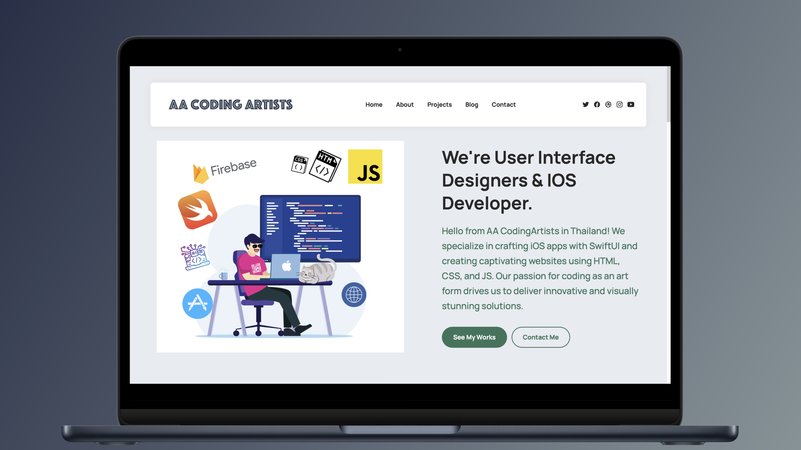

# AACodingArtists
# Short Description
AACodingArtists Portfolio Website

🌐 About the Project

Welcome to the AACodingArtists repository! This website serves as a portfolio for iOS and web developers. Here, you'll find samples of our work, team information, and other useful resources.

🛠️ Technologies Used

HTML5: For structuring the website
CSS3: For styling and responsive design
JavaScript: For interactive elements
🎨 Design Features

We have focused on a minimalist yet stylish design to enhance the user experience and make navigation through the site a breeze.

📱 Interface

The site is optimized for cross-platform use, including mobile devices and desktops.

💻 Local Installation

Clone the repository
bash
Copy code
git clone https://github.com/ToleonPrins/AACodingArtists.git
Open index.html in your browser

👇 If you like the project, don't forget to star it!

# GIF Demo

# Video
[Check out my YouTube video!](https://www.youtube.com/watch?v=A7WBrWJD2zA)
